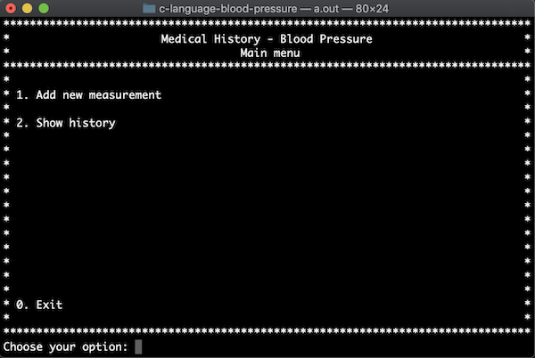
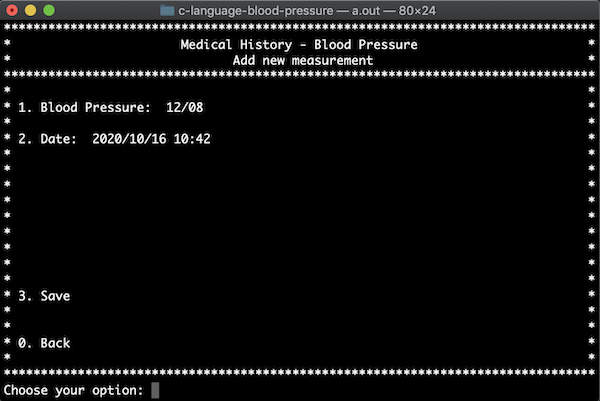
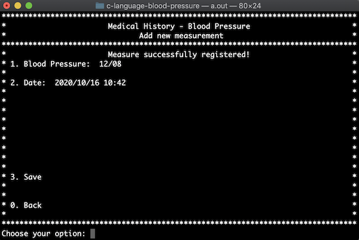
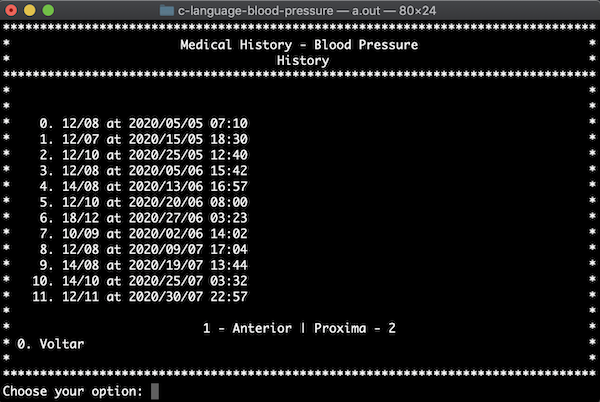

# Blood Pressure

This system record your blood pressure measures and allows you to get your history for medical help.

## Prerequisites

For this code, you will need a C language compiler.

## Compiling and running

You can build this system in any linux-based system using gcc in root folder, as follow:
```
$ gcc main.c -o BloodPressure
```

This will create a new executable in the project root path named BookSystem (or BookSystem.exe on windows). Now you only need to run it:

For Linux/MAC users:

```
./BloodPressure 
```

For Windows users, just double click on executable program.

## How to use

Considering that this system was developed in C, the use is around choosing options by typing a number of the option, then pressing Enter key to confirm.

## Some screens

This is the main menu screen:




This is the add new blood pressure form menu:




Example of confirmation message:




This is list blood pressure measures screen:




## To do better

- [ ] Create file persistence layer
- [ ] Allow remove records
- [ ] Search books by author
- [ ] Order by creation date on list screen


## Authors

- **Nicolas Anelli** - [Github](https://github.com/NicolasAnelli).

### Considerations:

Feel free for forking this project, and submiting any improvement.

## License

MIT License

Copyright (c) 2020 Nicolas Anelli

Permission is hereby granted, free of charge, to any person obtaining a copy
of this software and associated documentation files (the "Software"), to deal
in the Software without restriction, including without limitation the rights
to use, copy, modify, merge, publish, distribute, sublicense, and/or sell
copies of the Software, and to permit persons to whom the Software is
furnished to do so, subject to the following conditions:

The above copyright notice and this permission notice shall be included in all
copies or substantial portions of the Software.

THE SOFTWARE IS PROVIDED "AS IS", WITHOUT WARRANTY OF ANY KIND, EXPRESS OR
IMPLIED, INCLUDING BUT NOT LIMITED TO THE WARRANTIES OF MERCHANTABILITY,
FITNESS FOR A PARTICULAR PURPOSE AND NONINFRINGEMENT. IN NO EVENT SHALL THE
AUTHORS OR COPYRIGHT HOLDERS BE LIABLE FOR ANY CLAIM, DAMAGES OR OTHER
LIABILITY, WHETHER IN AN ACTION OF CONTRACT, TORT OR OTHERWISE, ARISING FROM,
OUT OF OR IN CONNECTION WITH THE SOFTWARE OR THE USE OR OTHER DEALINGS IN THE
SOFTWARE.
